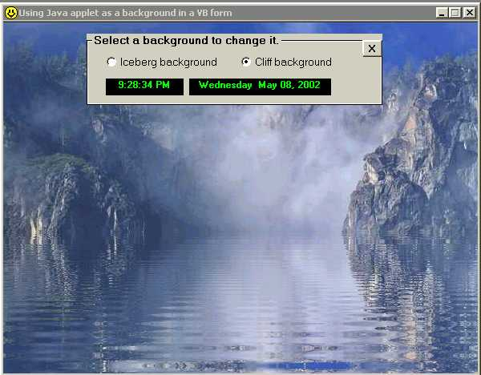



## Using Java applet as a background in a VB form

### Description

Ever wondered how a java applet would look as a background in a VB form?, well 'check out this example.

This example uses Anfy lake class to demonstrate this effect
 
### More Info
 

             |
---                |---
**Submitted On**   |2002-05-08 21:19:46
**By**             |[louie](https://github.com/Planet-Source-Code/PSCIndex/blob/master/ByAuthor/louie.md)
**Level**          |Beginner
**User Rating**    |4.8 (276 globes from 57 users)
**Compatibility**  |VB 5\.0, VB 6\.0
**Category**       |[Coding Standards](https://github.com/Planet-Source-Code/PSCIndex/blob/master/ByCategory/coding-standards__1-43.md)
**World**          |[Visual Basic](https://github.com/Planet-Source-Code/PSCIndex/blob/master/ByWorld/visual-basic.md)
**Archive File**   |[Using\_Java80977582002\.zip](https://github.com/Planet-Source-Code/louie-using-java-applet-as-a-background-in-a-vb-form__1-34590/archive/master.zip)

